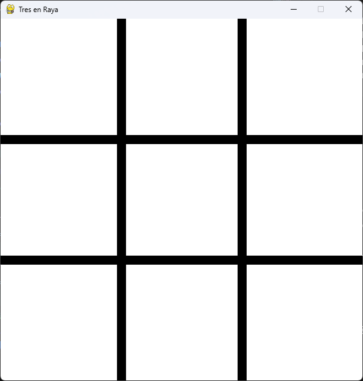
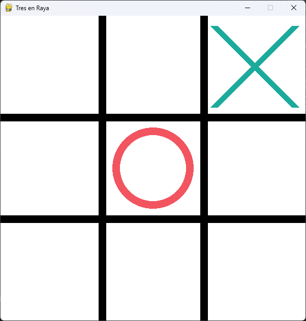
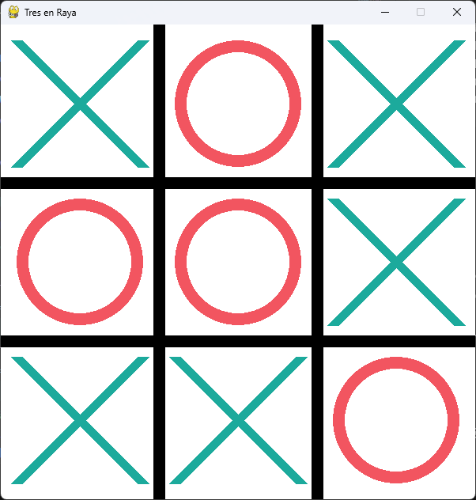

# Documentación del Juego Tres en Raya (Tic-Tac-Toe) con Pygame y Minimax

Este proyecto implementa un **juego de Tres en Raya (Tic-Tac-Toe)** en **Python** usando **Pygame** para la interfaz visual y un **algoritmo Minimax** para la inteligencia artificial.

---

## 📌 Descripción General

El juego permite a un jugador humano competir contra la computadora. La computadora siempre juega con el símbolo `O` y el humano con `X`. La IA utiliza **Minimax**, un algoritmo de búsqueda recursiva, para garantizar que siempre elija la jugada óptima.

El tablero es de 3x3 y se representa visualmente con Pygame, mostrando las líneas del tablero, las X y O dibujadas con colores distintos.

---

## 🗂 Estructura del Código

### 1. Configuración e inicialización

```python
WIDTH, HEIGHT = 600, 600
LINE_COLOR = (0, 0, 0)
BG_COLOR = (255, 255, 255)
CIRCLE_COLOR = (242, 85, 96)
CROSS_COLOR = (28, 170, 156)
```

- Se define el tamaño de la ventana, colores, grosor de líneas y tamaño del tablero.
- Se inicializa Pygame y la ventana de juego.

### 2. Clase TicTacToe

Esta clase representa el estado del juego y contiene los métodos necesarios para la lógica de AI.

#### Atributos:
- `board`: lista 3x3 que guarda el estado del tablero (None, 'X' o 'O').
- `current_player`: jugador que tiene el turno ('X' o 'O').

#### Métodos principales:

- `player()`

    Devuelve el jugador actual.
- `actions()`

    Devuelve una lista de movimientos posibles en el tablero en el estado actual, como coordenadas (fila, columna).
- `result(action)`

    Devuelve un nuevo estado del juego después de aplicar un movimiento, cambiando también el turno al otro jugador.
- `terminal()`

    Comprueba si el juego ha terminado, ya sea por victoria o empate.
- `utility()`

    Devuelve un valor numérico del estado:
    - **1** si gana **X**
    - **-1** si gana **O**
    - **0** si hay empate
- `winner()`

    Devuelve 'X', 'O' o None según quién haya ganado.

### 3. Algoritmo Minimax
```python
def minimax(state):
    ...
```
Es un algoritmo recursivo que evalúa todas las posibles jugadas futuras para elegir la mejor acción.

Funciona así:
- Si el estado es terminal, devuelve su utilidad.
- Si el jugador actual es X (maximizador):
Busca la acción que maximice la utilidad.
- Si el jugador actual es O (minimizador):
- Busca la acción que minimice la utilidad.
La IA siempre elige la acción óptima según este cálculo.

 **Ventaja**: garantiza que la IA no perderá.

### 4. Interfaz Visual con Pygame

#### Dibujo del tablero

```python
def draw_lines():
    ...
```
Dibuja 2 líneas horizontales y 2 verticales para formar un tablero 3x3.

#### Dibujo de marcas
```python
def draw_marks(board):
    ...
```
Recorre el tablero y dibuja:
- **X** con líneas cruzadas (`CROSS_COLOR`)
- **O** con un círculo (`CIRCLE_COLOR`)

### 5. Bucle Principal del Juego
```python
while running:
    for event in pygame.event.get():
        ...
```
Maneja eventos de Pygame:
- Clics del jugador humano para colocar X.
- Turno de la IA: calcula la mejor jugada usando minimax.
- Actualiza la pantalla con draw_marks().
- Verifica si el juego ha terminado con terminal().

## 🎮 Flujo de Juego
1. El jugador X hace clic en un cuadrado vacío.
2. El tablero se actualiza y el turno cambia a O.
3. La IA evalúa el tablero usando Minimax y coloca su O.
4. El turno vuelve al jugador humano.
5. Se repite hasta que haya un ganador o empate.

### 📸 Vista Previa del Juego

A continuación se muestran capturas de pantalla del sistema en ejecución:

| Pantalla Inicial | Turno de la IA | Fin del Juego |
| :---: | :---: | :---: |
| Tablero vacío | Tras nuestro turno, se marca el turno de la IA | Fin del Juego |
|  |  |  |

Al finalizar, se muestra el resultado por consola y se cierra el juego tras unos segundos.

## ⚙ Algoritmos Implementados

### 1. Minimax
- Algoritmo clásico de teoría de juegos.
- Evalúa recursivamente cada movimiento posible hasta estados terminales.
- Funciona para juegos de suma cero, perfectos y determinísticos como Tres en Raya.

### 2. Lógica de Juego
- Métodos `actions`, `result`, `terminal`, `utility`, `winner` implementan el modelo de juegos para AI, permitiendo la integración con Minimax.
- El tablero se representa como una matriz 3x3, fácil de recorrer y evaluar.

## 🛠 Posibles Mejoras Futuras
- Implementar poda alfa-beta para acelerar la IA.
- Agregar un menú para elegir quién comienza.
- Soporte para dos jugadores humanos.
- Mejorar la interfaz visual y agregar animaciones.
- Guardar estadísticas de partidas (ganadas, perdidas, empatadas).

## 🔗 Conclusión

Este proyecto combina programación visual con algoritmos de inteligencia artificial en Python, siendo un excelente ejemplo educativo de:

- Implementación de un juego clásico.
- Uso de Pygame para interfaces gráficas.
- Aplicación de Minimax y teoría de juegos.
